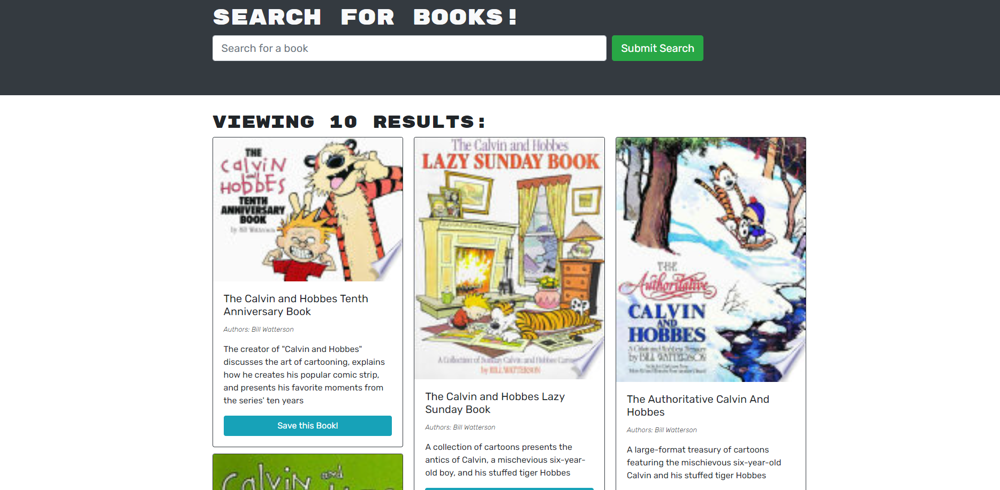
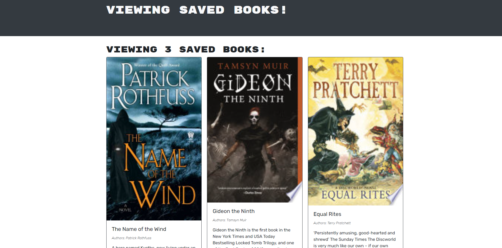

# Google Book Search App

  ## Table of Contents
  - [Description](#description)
  - [Installation Instructions](#installation-instructions)
  - [Usage Information](#usage-information)
  - [Questions?](#questions)

  ## Description
  This is an app that allows users to create an account, search for books using GoogleBooks' API, save books for future reference, and delete books if no longer needed.
  ## Installation Instructions
  From Github: Download the repository. Open with VS Code and install all required Node modules. Run the command "npm run develop" to boot the app on a localhost, and begin your book search. From Heroku: Visit https://peaceful-stream-07540.herokuapp.com/, sign up, and begin your book search.
  ## Usage Information
  From GitHub: After booting the server, navigate to the localhost page. Sign up and begin your book search. From Heroku: Visit https://peaceful-stream-07540.herokuapp.com/. Sign up and begin your book search.

  
  
  ## Questions?
  Find me on github at gleeson-emily. 

  Special shout-out to my TA Luca and my instructor Deep, who helped with a whole host of debugging both during and outside of office hours!